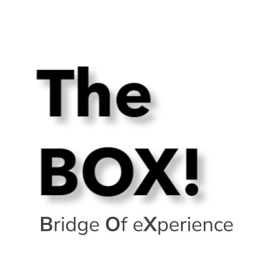

# BrainStation BOX Server

  

## Overview

Welcome to the BrainStation BOX server application! This backend powers our yearbook and social networking platform, featuring a robust RESTful API, secure authentication, real-time functionalities, and AWS S3 integration for file handling.

## Features

- 🌐 RESTful API for client-server communication.
- 🔒 Secure authentication and authorization using JWT.
- 📊 MySQL database integration for structured data management.
- 📁 Modular and maintainable architecture with structured endpoints.
- 💾 AWS S3 integration for image and file storage.
- 💬 Real-time chat functionality using Socket.io.
- 🌟 TypeScript for type-safe code.

## Tech Stack

- 🚀 Express.js for the server framework.
- 🌐 MySQL for database management.
- 🔒 Passport.js and bcrypt for authentication.
- 📊 Knex.js for SQL query building and database operations.
- 💾 AWS SDK for S3 file storage.
- 💬 Socket.io for real-time communication.
- 🌟 TypeScript for server-side scripting.

## Installation

1. Clone the repository.
2. Navigate to the project folder: `cd brainstation-box-server`.
3. Install dependencies: `npm install`.
4. Set up environment variables: Copy `.env.sample` to `.env` and configure.
5. Compile TypeScript to JavaScript: `npm run build`.
6. Start the server: `npm start`.

## Deployment

This application is configured for deployment to Heroku, with necessary scripts and configurations for a smooth CI/CD process. Ensure that the Heroku CLI is installed and configured for deployment.

## API Documentation

Explore our API endpoints in [API_DOCS.md](./docs/API_DOCS.md). Key endpoints include user registration, login, profile retrieval, post creation, and more.

## Database Schema

Our MySQL schema includes tables for users, posts, comments, and more. For a detailed schema, refer to [DATABASE.md](./docs/DATABASE.md).

## AWS S3 Integration

TheBOX! utilizes AWS S3 for handling file uploads. Endpoints are available for generating pre-signed URLs for direct uploads to S3.

## Project Structure

For a detailed overview of the project's file and directory structure, please see [STRUCTURE.md](./docs/STRUCTURE.md) in the `docs` directory.

## Contribution

Contributions to TheBOX! are welcome. Please read [CONTRIBUTING.md](./docs/CONTRIBUTING.md) for contribution guidelines and our code of conduct.

## License

This project is strictly proprietary under the terms outlined in [LICENSE.md](./docs/LICENSE.md). Use and contribution must comply with these terms.

Thank you for exploring TheBOX!, a platform that brings yearbook experiences into the digital age.

- [Iman Hedeshy](https://github.com/imanhedeshy)
